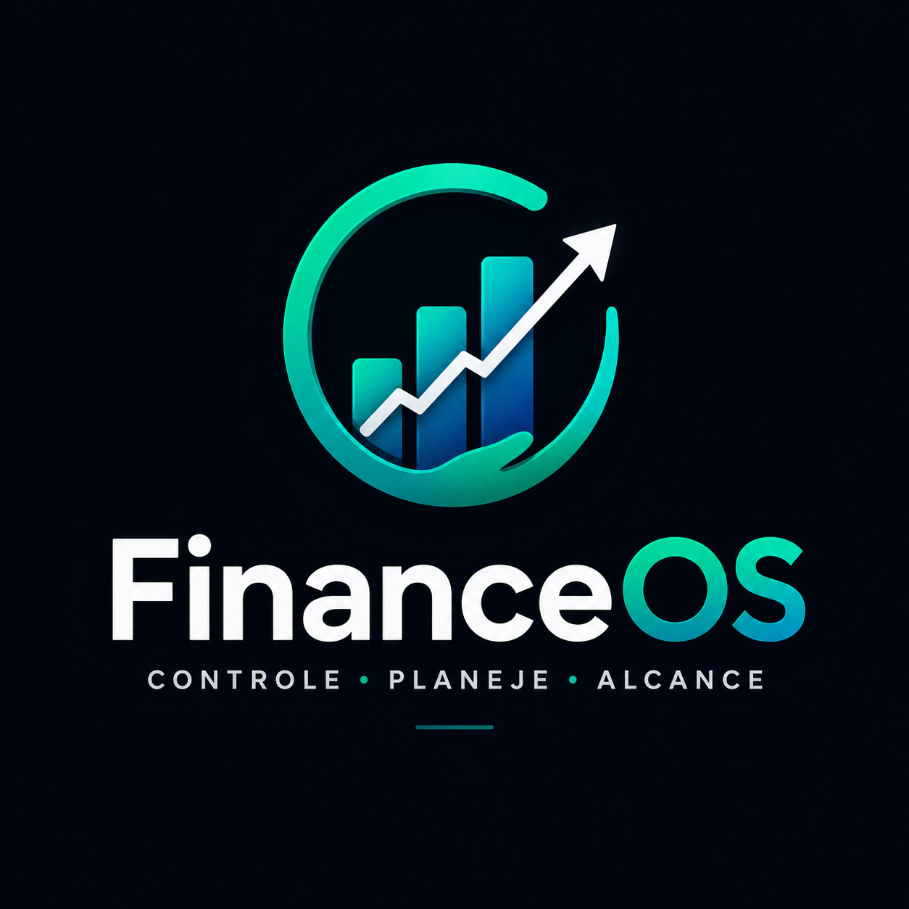
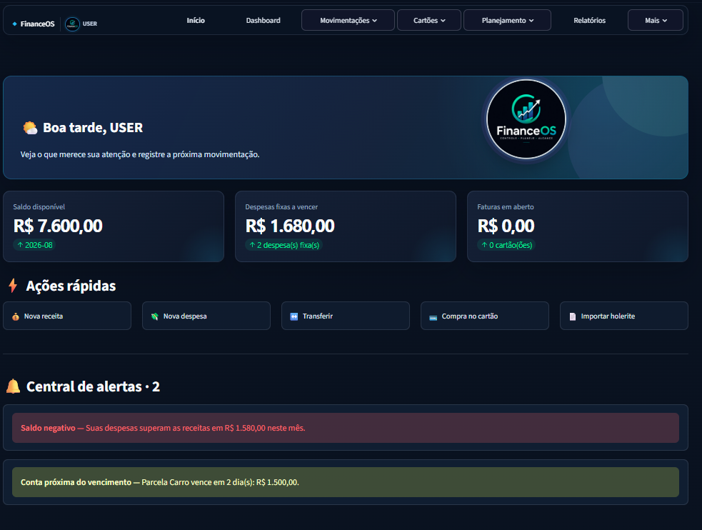
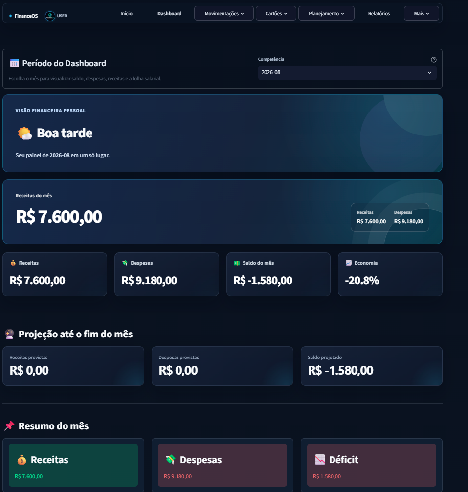
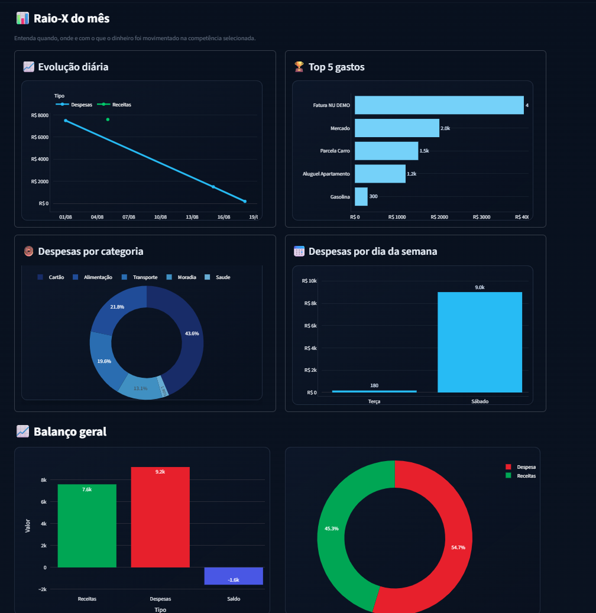

# FinanceOS

<p align="center">
  
</p>


## Visão geral

<p align="center">
  
</p>

<p align="center">
  
  
</p>

<p align="center"><sub>Interface exibida com dados exclusivamente demonstrativos.</sub></p>

> Plataforma web de gestão financeira pessoal construída com Python e Streamlit.

O **FinanceOS** centraliza receitas, despesas, cartões, contas bancárias,
orçamentos, metas, patrimônio e documentos financeiros em uma interface
responsiva. O projeto utiliza SQLite no desenvolvimento local e
PostgreSQL/Supabase em produção, com autenticação própria e isolamento dos dados
por usuário.

## Demonstração

A versão publicada pode ser acessada em:

**[financeos.gestao-financeira.workers.dev](https://financeos.gestao-financeira.workers.dev/)**

> A demonstração exige uma conta do FinanceOS. Não utilize dados financeiros
> reais em ambientes que você não administra.

## Principais funcionalidades

### Visão financeira

- Dashboard mensal com receitas, despesas, saldo e percentual de economia.
- Raio-X do mês com evolução diária, maiores gastos, categorias e dias da semana.
- Projeção mensal considerando lançamentos e recorrências pendentes.
- Próximos vencimentos, alertas, metas, contas bancárias e patrimônio.
- Comparativo entre competências e relatórios exportáveis.

### Movimentações

- Cadastro, pesquisa, edição e exclusão de receitas e despesas.
- Contas bancárias e transferências entre contas.
- Orçamentos mensais e lançamentos recorrentes.
- Metas financeiras e acompanhamento patrimonial.
- Conciliação bancária com prevenção de duplicidades e sugestões por data e valor.

### Cartões e faturas

- Gestão de cartões, limites, compras, faturas e parcelamentos.
- Registro e edição de compras lançadas manualmente.
- Pagamento de faturas por uma conta bancária cadastrada.
- Identificação de duplicidades e acompanhamento de parcelas futuras.
- Importação assistida de faturas Nubank, Mercado Pago, PicPay e outros emissores.
- Revisão de lançamentos ambíguos antes da gravação definitiva.

### Documentos e automações

- Importação de holerite em PDF.
- Leitura assistida de salário bruto, INSS, IRRF, consignado e salário líquido.
- OCR para documentos digitalizados, com Tesseract em português.
- Central Financeira com histórico e opção de desfazer importações.
- Fechamento mensal e regras inteligentes de categorização.
- Exportação de dados em CSV.

### Experiência de uso

- Interface responsiva para desktop, ultrawide, tablet e celular.
- Navegação horizontal no desktop e menu recolhível no mobile.
- Ajustes para Chrome, Safari e áreas seguras do iPhone.
- Tema escuro, acessibilidade e aviso de conexão perdida.

## Tecnologias

- **Python 3.11+** e **Streamlit**
- **PostgreSQL**, **Supabase** e **psycopg 3**
- **SQLite** para desenvolvimento e execução local
- **Pandas**, **Plotly** e **Altair**
- **PyMuPDF**, **pypdf**, **Pillow** e **Tesseract OCR**
- **Streamlit AgGrid** e **Streamlit Modal**
- **Docker**, **Docker Compose** e **Caddy**
- **Streamlit Community Cloud**, **Cloudflare Workers** e **Wrangler**
- **GitHub** para versionamento e integração de deploy

## Arquitetura

```text
Navegador
   |
   +-- Cloudflare Workers (endereço e camada externa)
           |
           +-- Streamlit Community Cloud (aplicação Python)
                   |
                   +-- PostgreSQL / Supabase (produção)

Desenvolvimento local
   |
   +-- Streamlit + SQLite
```

O Cloudflare fornece o endereço externo e incorpora a aplicação publicada. A
lógica, a autenticação e o acesso ao banco permanecem no servidor Streamlit.

## Executando localmente

### Pré-requisitos

- Python 3.11 ou superior
- Git
- Tesseract OCR, caso queira importar documentos digitalizados

### Windows PowerShell

```powershell
git clone <URL_DO_REPOSITORIO>
cd FinanceOS

python -m venv .venv
.\.venv\Scripts\Activate.ps1
python -m pip install --upgrade pip
pip install -r requirements.txt

streamlit run app.py --server.port 8503
```

A aplicação estará disponível em `http://localhost:8503`. Sem `DATABASE_URL`,
o banco SQLite será criado automaticamente em `database/finance.db`.

### Variáveis opcionais

| Variável | Finalidade |
| --- | --- |
| `DATABASE_URL` | Conexão PostgreSQL usada em produção |
| `FINANCEOS_DB_FILE` | Caminho do banco SQLite local |
| `FINANCEOS_BACKUP_DIR` | Diretório dos backups SQLite |
| `FINANCEOS_ADMIN_USER` | Usuário com perfil administrativo |
| `FINANCEOS_SESSION_TIMEOUT_MINUTES` | Tempo de inatividade antes do encerramento da sessão |

Use o arquivo `.env.example` apenas como referência. Nunca versione `.env`,
`secrets.toml`, bancos de dados, backups ou credenciais.

## Produção com Supabase

Em produção, configure `DATABASE_URL` nos **Secrets do Streamlit** usando a URI
do **Session pooler** do Supabase. Quando essa variável existe, o FinanceOS usa
PostgreSQL; caso contrário, utiliza SQLite.

As tabelas no schema `public` devem permanecer com **Row Level Security (RLS)**
ativado e sem privilégios para os papéis `anon` e `authenticated`. O FinanceOS
acessa o PostgreSQL pelo servidor Streamlit e não expõe a URI ao navegador.

Para migrar dados existentes, consulte
[docs/MIGRACAO_SUPABASE.md](docs/MIGRACAO_SUPABASE.md).

## Segurança e privacidade

- Dados financeiros associados ao usuário autenticado.
- Senhas protegidas com PBKDF2-HMAC-SHA256 e salt individual.
- Bloqueio temporário após cinco tentativas de login sem sucesso.
- Encerramento de sessões inativas.
- Apenas `FINANCEOS_ADMIN_USER` recebe perfil administrativo.
- RLS habilitado nas tabelas públicas do Supabase.
- PDFs limitados a 10 MB e 50 páginas, com validação antes do processamento.
- Imagens de perfil verificadas antes do armazenamento.
- Script de release que bloqueia arquivos sensíveis rastreados pelo Git.

> Este é um projeto de gestão financeira pessoal. Revise as configurações de
> segurança, faça backups e proteja as credenciais antes de utilizar uma
> instalação própria com dados reais.

## Docker

```bash
cp .env.example .env
docker compose config
docker compose build --pull
docker compose up -d
```

O `compose.yaml` utiliza um volume persistente para o SQLite e executa o Caddy
como proxy HTTPS. Leia [docs/DEPLOY_PRODUCAO.md](docs/DEPLOY_PRODUCAO.md) antes
de publicar uma instalação própria.

## Testes e verificação de release

No Windows:

```powershell
.\.venv\Scripts\python.exe -m unittest discover -s tests -v
python scripts/check_release.py
```

Os testes usam um banco temporário e não modificam os dados financeiros locais.
A verificação de release impede o versionamento de bancos, arquivos `.env`,
secrets, caches e outros artefatos locais.

## Estrutura resumida

```text
FinanceOS/
├── app.py                 # Entrada da aplicação
├── auth.py                # Autenticação e sessões
├── pages/                 # Páginas do Streamlit
├── components/            # Interface, gráficos e componentes reutilizáveis
├── services/              # Regras de negócio
├── database/              # SQLite, PostgreSQL e esquema de dados
├── utils/                 # Importadores e processamento de documentos
├── tests/                 # Testes automatizados
├── cloudflare-pages/      # Camada externa publicada no Cloudflare
├── docs/                  # Guias de implantação e migração
└── scripts/               # Migração e verificação de release
```

## Roadmap

- Ampliar a cobertura dos testes automatizados.
- Adicionar mais formatos de faturas e extratos.
- Evoluir relatórios e exportações financeiras.
- Melhorar monitoramento, auditoria e recuperação de backups.
- Expandir recursos de edição e arquivamento de registros.

## Autor

Desenvolvido por **Alison S. Nascimento** como projeto pessoal de organização
financeira e evolução técnica.
